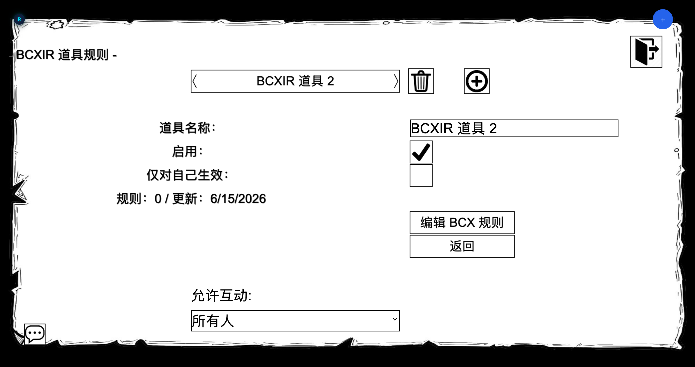
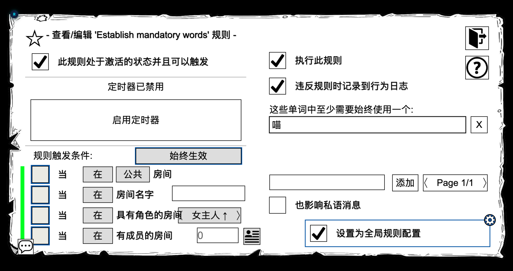

This page covers how to register a crafted item name and attach BCX rules to it using BCXIR's virtual authoring flow.

## The registry

Every item rule you create lives in your **local registry**, keyed by your member number:

```text
localStorage["BCXIR_registry_<MemberNumber>"]
```

Each entry has:

| Field | Meaning |
| --- | --- |
| **Name** | The exact crafted item name to match. |
| **Enabled** | Whether the entry participates in matching/sharing. |
| **Self-only** | If on, the rule is for you only and is never shared to other players. |
| **Rules count** | How many BCX rules the payload contains. |
| **Updated** | Last edit timestamp. |

## Create an entry

1. Open **`BCXIR Settings` → Item Rules**.
2. Choose **Create / Add** and type the crafted item name exactly as it appears in game.
3. A new, enabled entry is created with a valid but empty payload, ready to edit.

From the Item Rules list you can also **rename**, **duplicate**, **enable/disable**, **delete**, **match test**, and **sync** entries.



## Edit rules with the virtual authoring character

Selecting **Edit BCX Rules** starts an authoring session:

- BCXIR activates a **virtual BCX transport** and creates a temporary local **`BCXIR Authoring`** character.
- It opens that character's **Information Sheet → Rules**, giving you the real BCX Rules editor.
- Everything you do there is answered **locally** by an in-memory virtual rules store; nothing is sent to the server and your own BCX is never touched.

Inside the editor you can use the BCX Rules features that the authoring store supports, including creating, deleting, and configuring rule conditions and the Rules global configuration.

When you choose **Finish / Save**:

- The virtual rules are exported as a compact BCXIR payload.
- The payload is saved to the registry entry **under the item name you were editing**.
- The temporary character and virtual transport are cleaned up.

> **Cancelling.** If something goes wrong, you can cancel authoring from **Debug / Diagnostics → Cancel authoring**. The temporary character and transport are removed without saving.



## Self-only entries

Toggle **Self-only** on an entry if the rules are meant for you and should never be shared. Self-only entries:

- Still apply to you when you wear the matching item.
- Are **never** returned to other players who request the payload.

See [Sharing & Permissions](/bcxir/sharing) for how sharing and self-only interact.

## How matching works at runtime

When a crafted item is worn, BCXIR decides what to do based on **who created it**:

- **Created by you** → BCXIR reads your local **registry** and applies the rule as configured.
- **Created by someone else** → BCXIR checks your local **cache**, and if needed requests the payload from the creator (see [Sharing](/bcxir/sharing)).

For the full runtime/restore behavior and storage details, see [How It Works](/bcxir/how-it-works).