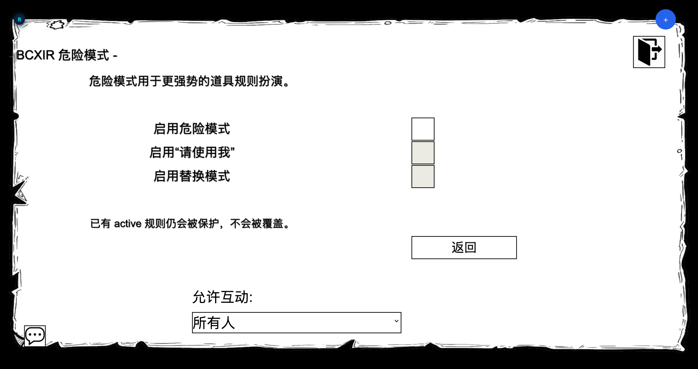

> **仅限高级用户。** 危险模式会解锁一些选项，它们会以正常 BCX 权限检查本会阻止的方式改变规则的应用。只有在你充分理解后果时才启用。

危险模式是一个**独立的、需主动开启**的设置页，拥有自己的**总开关**。下面两个有风险的选项是**相互独立的子开关**，只有在总开关启用**之后**才能修改。

```ts
dangerModeEnabled: boolean            // 总开关（默认 false）
unlockUseMeMode: boolean              // 子开关：“请使用我”（默认 false）
useMeSuspendInactiveConflicts: boolean // 子开关：替换行为（默认 false）
```

如果总开关为关，两个子开关都会被强制关闭；已保存的 `请使用我` 运行模式会回退为**道具制作者**。



## 请使用我（Please use me）

`请使用我` 是一个高级运行**权限模式**。只有在危险模式和 `请使用我` 子开关都启用**之后**，它才会出现在运行模式选择器中。激活后，运行模式会在 **道具制作者 → 我自己 → 请使用我** 之间循环。

它做的事：

- 通过 BCX 自身的隐藏查询处理器，使用一个**临时本地操作者角色**来应用 BCXIR 道具规则。
- 在查询批处理期间，BCXIR 让该操作者以高信任的本地 owner 身份行事，使得**即使正常 BCX 权限检查会阻止对自己的修改，道具规则也能被应用**。
- 该操作者**不会被绘制**、**不会同步**到服务器，并在查询解析或超时后通过 `finally` 式清理被移除。
- 它**不会**直接编辑 `Player.ExtensionSettings.BCX`，而是依赖 BCX 自身的创建 / 更新 / 删除处理器，而非改写 BCX 存档。

如果 BCX 拒绝查询、超时，或改变了其隐藏查询行为，BCXIR 会**失败即停**并报告冲突。

## 替换模式（挂起 inactive 冲突）

由其自身的子开关（`useMeSuspendInactiveConflicts`）控制。它改变 BCXIR 处理**已存在但处于 inactive 的同名规则**的方式：

- **已存在的 active 规则始终受保护** —— 绝不覆盖。
- 该选项**关闭**时，已存在的 inactive 同名规则会被**跳过**。
- 该选项**开启**时，已存在的 **inactive** 同名条件可以被存为 `previousCondition`、被 BCXIR 规则临时**替换**，并在道具规则移除时**恢复**。

如果某个被管理的规则在 BCXIR 之外被修改，BCXIR 会**释放管理**，不会覆盖或在外部改动之上恢复。

## 安全小结

- 两个选项都需要先打开危险模式总开关，且均为显式的主动开启。
- BCXIR 使用 BCX 自身的处理器，而非导入 / 改写整份 BCX 配置。
- 已存在的 active、非管理规则绝不被覆盖。
- 临时操作者角色始终会被清理，包括超时或被拒绝的情况。

对于常规使用，你**不需要**危险模式。默认的**道具制作者**模式和标准分享已能覆盖典型工作流。