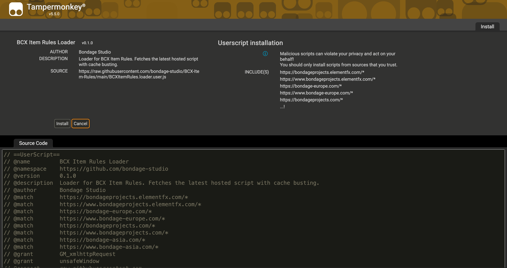
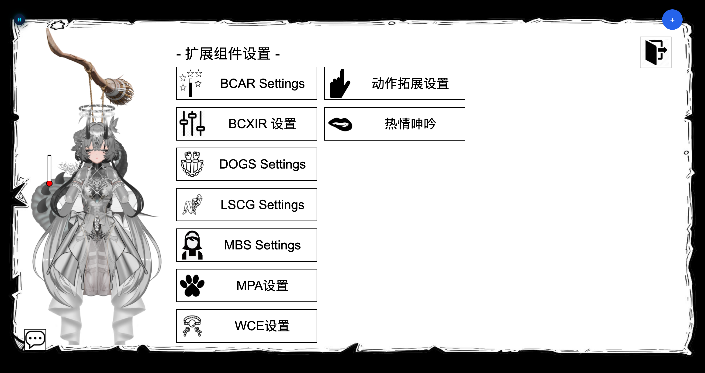

## 前置条件

1. **一个用户脚本管理器。** 推荐 [Tampermonkey](https://www.tampermonkey.net/)（Chrome、Edge、Firefox）。
2. **BCX**，已在游戏中安装并正常工作。BCXIR 需要 BCX 以 `window.bcx` 的形式存在。如果没有 BCX，BCXIR 不会应用任何规则。

## 安装 loader

你始终只需安装 **loader**。loader 体积很小，会自动拉取最新的运行脚本，因此你几乎不需要重新安装它。

从 GitHub Pages 安装 —— 使用具备自动更新能力的规范地址（loader 自身就用这个地址拉取更新）：

```text
https://bondage-studio.github.io/BCX-Item-Rules/BCXItemRules.loader.user.js
```

> **兼容别名。** 如果你之前是从 `BCXItemRules.user.js` 安装的，这个文件是 loader 的别名，仍然可用：
>
> ```text
> https://bondage-studio.github.io/BCX-Item-Rules/BCXItemRules.user.js
> ```

打开上述任一链接后，Tampermonkey 会显示安装页面。检查 `@match` 条目，然后点击**安装**。loader 以 `@grant none` 运行，无需任何特殊权限。



## loader 更新机制

loader 会从 GitHub Pages 在线注入运行脚本：

```text
https://bondage-studio.github.io/BCX-Item-Rules/BCXItemRules.script.js
```

由于 GitHub Pages 以 JavaScript content type 返回该文件，loader 直接以普通 `<script>` 标签注入——无需 `GM_xmlhttpRequest` 或 `eval`。每次加载都会追加缓存爆破参数，使更新立即生效：

```text
?t=<时间戳>
```

这样安装的脚本保持很小，发布新的运行脚本后无需你重新安装 loader 即可生效。

## 验证安装

1. 在受支持的域名（如 `bondageprojects.com`）打开 Bondage Club 并登录。
2. 确认 BCX 已加载。
3. 打开游戏内的**扩展设置菜单**，查找 **`BCXIR Settings`**。

如果你能打开 `BCXIR Settings`，说明安装成功。继续阅读[快速上手](/zh/bcxir/quick-start)。



## 受支持的站点

loader 在标准的 Bondage Club 域名上运行，包括：

- `bondageprojects.elementfx.com`
- `bondage-europe.com`
- `bondageprojects.com`
- `bondage-asia.com`

（同时支持裸域名和 `www.` 变体。）