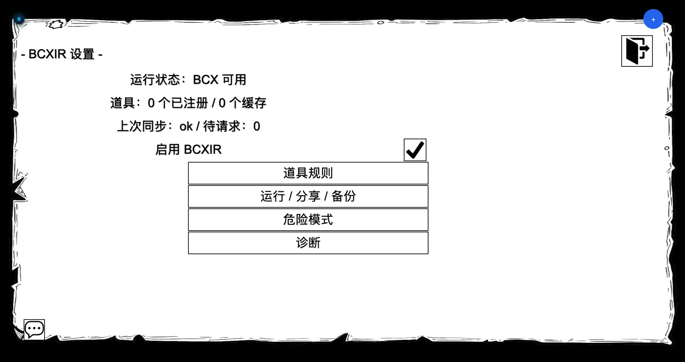
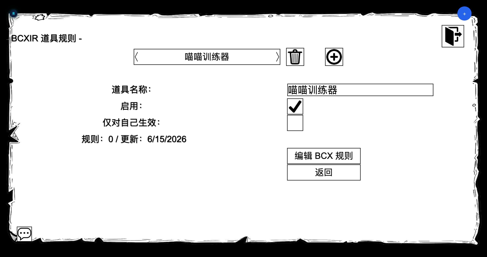
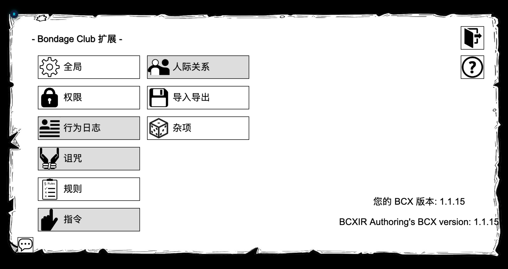
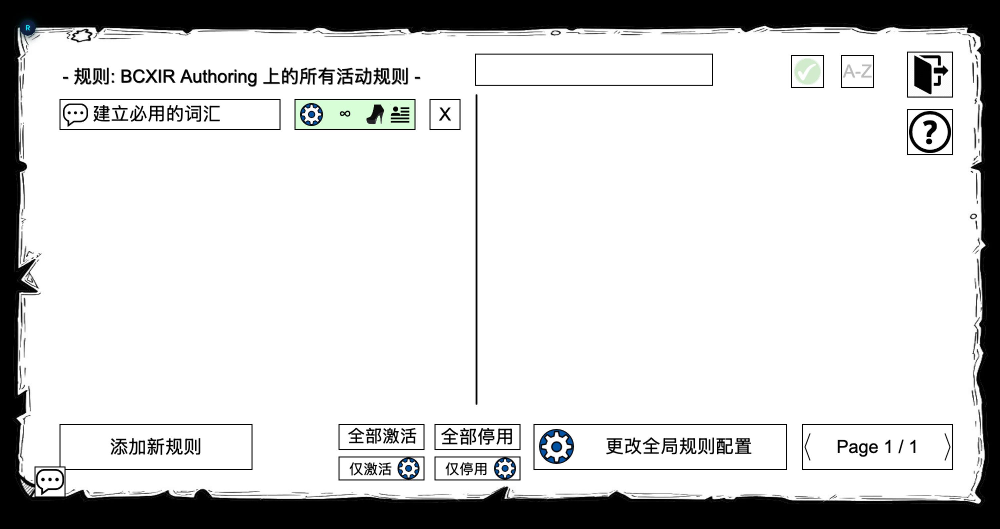

本教程带你从全新安装走到一条可用的道具规则。前提是已安装 BCXIR 和 BCX（见[安装](/zh/bcxir/getting-started)）。

## 1. 打开 BCXIR Settings

打开 Bondage Club 扩展设置菜单，选择 **`BCXIR Settings`**。主页面会显示状态，并提供到各子页面的入口：**道具规则（Item Rules）**、**运行与权限（Runtime & Permissions）**、**缓存与分享（Cache & Sharing）**、**导入 / 导出（Import / Export）**、**调试 / 诊断（Debug / Diagnostics）** 和 **高级（Advanced）**。

## 2. 创建一个道具规则条目

1. 打开**道具规则（Item Rules）**。
2. 选择**创建 / 添加**，输入你要附加规则的**制作道具的精确名称**（例如 `Strict Blindfold`）。
3. 新条目会出现在列表中，处于启用状态，规则 payload 为空。

> **名称匹配。** 条目名称必须与制作道具的**名称**完全一致。BCXIR 通过名称把穿戴的制作道具与你的注册表进行匹配。

## 3. 编辑规则

1. 选中你的条目，选择 **Edit BCX Rules（编辑 BCX 规则）**。
2. BCXIR 会打开一个**临时虚拟 BCX 编辑角色**，并显示你熟悉的 BCX **Rules** 界面。
3. 添加并配置你希望该道具携带的 BCX 规则。
4. 选择 **Finish / Save（完成 / 保存）**。规则会写回你的 BCXIR 注册表条目 —— **而非**你自己的 BCX。

完整编辑流程见[创建道具规则](/zh/bcxir/creating-rules)。

打开编辑器需要分两步：

1. 在虚拟编辑角色的 BCX 扩展菜单中，选择 **规则（Rules）**。

   

2. BCX 规则列表随即打开。用 **添加新规则** 来创建并配置规则。

   

## 4. 穿戴道具并查看应用效果

1. 制作（或已拥有）一件名称与你的条目匹配、且由你本人制作的道具。
2. 穿上它。
3. BCXIR 检测到匹配，并通过 BCX 把已注册的规则 payload 应用到本地的你身上。

当你脱下道具时，BCXIR 会恢复或删除它所管理的规则，同时不触碰你的其他 BCX 规则。

## 5.（可选）让别人也能用你的道具

如果你把制作道具给了其他玩家，对方的游戏可以按需向你请求规则并在本地缓存。详见[分享与权限](/zh/bcxir/sharing)。

## 接下来

- [创建道具规则](/zh/bcxir/creating-rules) —— 深入了解编辑流程。
- [分享与权限](/zh/bcxir/sharing) —— 远端请求、缓存、制作者 / 自己模式、仅自己与外来道具控制。
- [设置项参考](/zh/bcxir/settings) —— 每个页面和选项。