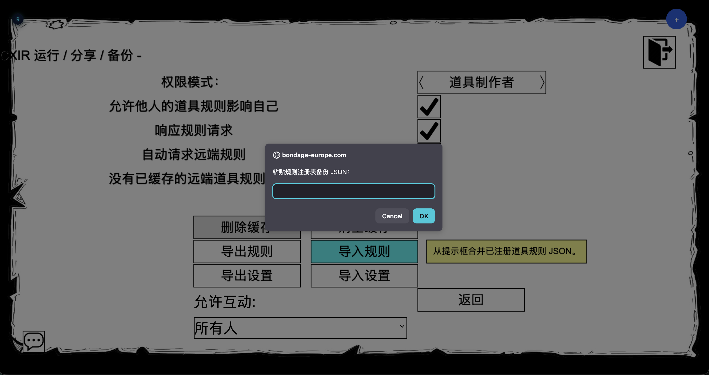

打开 Bondage Club 原生扩展设置菜单，选择 **`BCXIR Settings`**。菜单被拆分为若干聚焦的页面。


## 主页面

显示当前状态，并链接到所有子页面：

- **道具规则（Item Rules）**
- **运行与权限（Runtime & Permissions）**
- **缓存与分享（Cache & Sharing）**
- **导入 / 导出（Import / Export）**
- **调试 / 诊断（Debug / Diagnostics）**
- **高级（Advanced）**

## 道具规则

创建并管理已注册的道具规则条目。每个条目包含：

| 控件 | 说明 |
| --- | --- |
| **名称** | 要匹配的制作道具名称。 |
| **启用** | 切换是否参与匹配 / 分享。 |
| **仅自己** | 让规则只对你生效，绝不分享。 |
| **规则数量** | payload 中的规则条数。 |
| **更新时间** | 最近编辑时间。 |
| **Edit BCX Rules** | 打开虚拟编辑流程（[创建道具规则](/zh/bcxir/creating-rules)）。 |
| **复制** | 复制一个条目。 |
| **删除** | 移除一个条目。 |
| **匹配测试** | 检查某名称是否会匹配。 |
| **同步** | 对条目重新执行同步。 |

## 运行与权限

- **应用模式** —— `道具制作者` / `我自己`（当[危险模式](/zh/bcxir/dangerous-mode)解锁后还有 `请使用我`）。
- **缓存的离线制作者** —— 允许在制作者离线时应用其缓存规则（见[分享](/zh/bcxir/sharing#缓存的离线制作者)）。
- **道具类别扫描** —— 控制如何扫描已穿戴的道具。
- **回退同步。**
- **外来道具规则** —— 允许或阻止他人的道具影响你。

## 缓存与分享

- **响应请求** —— 回应针对你道具的传入 payload 请求。
- **自动请求远端规则** —— 为你穿戴的外来道具拉取规则。
- **通信消息** —— 通信活动的可见性。
- **删除缓存**与**清除冷却**。

## 导入 / 导出

以 JSON 形式备份和恢复你的注册表与设置。用它在不同存档间迁移 BCXIR 数据，或保留游戏外备份。



## 调试 / 诊断

- 消息 / 日志开关。
- 同步状态。
- 诊断报告。
- **取消编辑（Cancel authoring）** —— 中止进行中的编辑会话。
- **释放被管理规则（Release managed rules）** —— 交还 BCXIR 当前管理的规则。

## 高级

破坏性的维护操作：重置、清除注册表 / 缓存、清理、以及关闭分享等动作。**危险模式**总开关及其子选项也位于该高级区域 —— 见[危险模式](/zh/bcxir/dangerous-mode)。

## 设置存储位置

设置保存在：

```text
Player.ExtensionSettings.BCXIR
```

同时会写入本地备份：

```text
localStorage["BCXIR_<MemberNumber>_backup"]
```

BCXIR **永远不会**写入：

```text
Player.ExtensionSettings.BCX
```