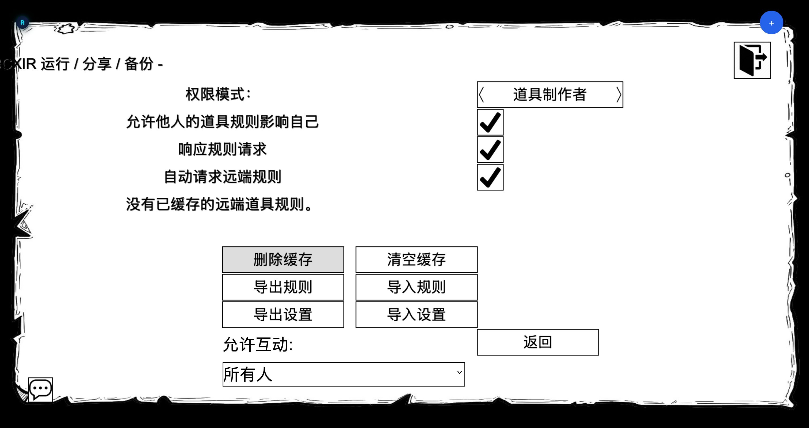

BCXIR 让制作道具能把规则“带”给其他玩家，而无需在道具本身中放入任何规则数据。本页解释分享如何工作，以及权限设置如何控制它。

## 分享流程

当你穿戴一件**由他人制作**的道具时：

1. BCXIR 检查你针对该制作者 + 道具的**本地缓存**：

   ```text
   localStorage["BCXIR_rule_cache_<MemberNumber>"]
   ```

2. 若存在缓存的 payload，则直接使用。
3. 若没有缓存，BCXIR 会通过类似 LSCG 的私密 `Leash` command beep 向道具制作者（`item.Craft.MemberNumber`）**请求** payload。
4. 只有**来自道具制作者**的响应才会被接受。随后该 payload 会缓存到本地以备后用。
5. 未得到响应的请求会进入**冷却 / 退避**，避免持续骚扰制作者。

在制作者一侧，BCXIR 可以（可配置地）**自动响应**这些请求，按请求的道具名称返回 payload —— 除非该条目被标记为**仅自己**。

## 权限模式：规则以谁的身份应用？

**运行与权限** 页面控制规则在本地以**谁的权限**被应用：

| 模式 | 行为 |
| --- | --- |
| **道具制作者**（默认） | 以制作道具的**制作者**作为 BCX 查询发送者来应用规则。这是常规的分享模式。 |
| **我自己** | 以**你自己**的身份应用规则，沿用旧的 public API 路径。 |
| **请使用我（Please use me）** | 仅在[危险模式](/zh/bcxir/dangerous-mode)下可用的高级模式。 |

### 缓存的离线制作者

在**道具制作者**模式下，制作者通常需要可被解析以供 BCX 权限检查。如果制作者**不在房间内**，但你有针对该制作者 / 道具的**可信缓存条目**，BCXIR 可以创建一个临时的、最小化的本地制作者角色，让 BCX 能够解析发送者。

这个最小制作者角色：

- **仅**用于本地 BCX 权限检查。
- **不会**在房间内绘制，**不会**同步到服务器。
- 不响应远端通信，也不接收强制的道具权限。
- 采用引用计数，无论成功或失败都会被清理。

缓存是**信任边界**：只有对你已从该制作者缓存过的 payload，才会发生离线制作者应用。该行为由运行与权限页面的 `allowCachedOfflineCreator` 开关控制。



## 控制你分享和接受的内容

### 仅自己（按道具）

把注册表条目标记为**仅自己**，它就会应用到你身上，但**绝不**返回给其他玩家的请求。见[创建道具规则](/zh/bcxir/creating-rules#仅自己条目)。

### 外来道具规则（全局）

在运行与权限页面，**外来道具规则**控制*他人*的道具是否能影响你。禁用后：

- 不发送任何远端请求。
- 不应用任何远端缓存。
- 不再产生新的最小离线制作者使用。
- 已有的被管理远端规则会在下次同步时通过正常清理路径释放。

### 缓存与分享页面

**缓存与分享** 页面掌管其余的分享控制：

- 响应收到的请求。
- 自动请求远端规则。
- 通信消息的可见性。
- 删除缓存与清除冷却。


## 信任与校验小结

- 远端响应**只**接受来自道具制作者成员编号的内容。
- 本地缓存是应用离线制作者规则的信任边界。
- 缺少缓存、缺少制作者成员编号、payload 损坏、或 BCX 查询被拒绝，都会**失败即停（fail closed）** —— 不应用任何内容。

内部细节见[工作原理](/zh/bcxir/how-it-works)。